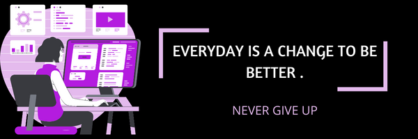

<!---
Megha296/Megha296 is a ✨ special ✨ repository because its `README.md` (this file) appears on your GitHub profile.
You can click the Preview link to take a look at your changes.
--->

<h1 align="center">Hi 👋, I'm MEGHA CHAUDHARY!</h1> 

## 👨🏻‍💻 About Me:

- 🙋🏻‍♀️ I'm someone who loves to interact and always eager to learn something new .

- 🔭 I’m currently working on `MYSELF`.

- 🌱 I’m currently doing `Computer Science Engineering`.

- 🤔 I’m looking for help with `Competitive Programming`.

- 👨‍💻 Life Hack: Learn , Explore , Implement and Repeat :tada:

- 💜 Obsessed with purple and coffee ☕

## 🛠️ Technologies I use and learning :

 

